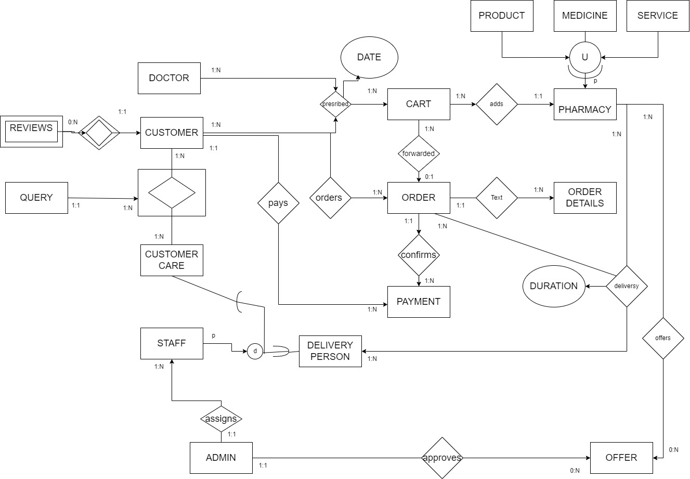
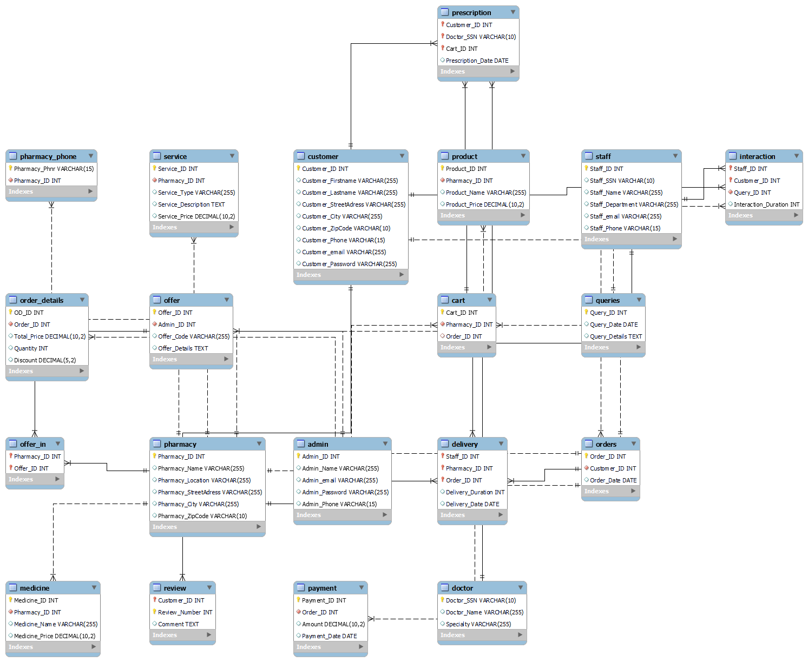

# Deli-Meds Database Project

A comprehensive pharmacy medication delivery system database implementation comparing relational (MySQL) and non-relational (MongoDB) approaches with Python integration for data analysis and visualization.

## Project Overview

This project explores database design and implementation through the development of a medication delivery system named "Deli-Meds". The project progression follows a systematic approach:

1. **Conceptual Modeling**: Created detailed Entity-Relationship (EER) and UML class diagrams to model the domain
2. **Logical Design**: Developed a comprehensive relational mapping based on the conceptual models
3. **SQL Implementation**: Implemented the design in MySQL with proper relationships and constraints
4. **NoSQL Alternative**: Redesigned the data model for MongoDB to explore document-oriented approaches
5. **Python Integration**: Connected both database systems to Python for analysis and visualization

The conceptual model diagrams (EER and UML) can be found in the `conceptual_model/` directory, showing the relationships between entities such as Customers, Doctors, Pharmacies, Orders, and more. The relational mapping derived from these models is implemented in the SQL schema, which can be referenced in the `sql/schema/` folder.

## Conceptual Models

### Entity-Relationship Diagram (EER)
The EER diagram models the relationships between entities in the Deli-Meds system:




This diagram shows the key entities such as Customer, Doctor, Pharmacy, and Order, along with their relationships and cardinality constraints.

### UML Class Diagram
The UML class diagram represents the object-oriented view of the system:


This diagram depicts the classes, their attributes, methods, and relationships in an object-oriented paradigm.

## Project Methodology & Comparative Study

This project serves as a comparative study between SQL and NoSQL database approaches for the same domain:

1. **Relational Approach (MySQL)**:
   - Traditional table-based design following normalization principles
   - Enforces data integrity through foreign keys and constraints
   - Supports complex joins across multiple entities

2. **Document-Oriented Approach (MongoDB)**:
   - Flexible schema design with embedded documents
   - Denormalized structure optimized for read performance
   - Supports horizontal scaling for large datasets

The Python integration demonstrates how both database systems can be queried and analyzed, providing insights into their respective strengths and performance characteristics.

## Repository Structure

- `conceptual_model/` - Contains EER and UML class diagrams
- `sql/`
  - `schema/` - Complete MySQL implementation with tables and relationships
  - `queries/` - Sample SQL queries demonstrating data retrieval and analysis
  - `data/` - Data files for populating the database
- `nosql/`
  - `schema/` - MongoDB schema design showing document structures
  - `queries/` - Sample MongoDB queries and aggregation pipelines
- `python/` - Python scripts for database connection, analysis, and visualization
- `docs/` - Implementation documentation and comparative analysis

## Database Design

The database design is based on a comprehensive domain analysis of a medication delivery system. Key entities include:

- **Customers** who place orders and write reviews
- **Doctors** who write prescriptions for customers
- **Pharmacies** that provide medicines, products, and services
- **Cart** system for temporary storage of selected items
- **Orders** that track customer purchases
- **Staff** including delivery personnel and customer care representatives
- **Admin** users who manage the system and create offers
- **Payment** processing for completed orders

The relationships between these entities are carefully modeled in both the relational and document-oriented approaches, with appropriate trade-offs for each system.

## Project Implementation

The implementation follows a systematic approach:

1. **Database Schema Creation**: 
   - MySQL tables with appropriate relationships, primary keys, and foreign keys
   - MongoDB collections with indexed fields and embedded documents

2. **Data Population**:
   - Generated realistic data using filldb.info
   - Imported data into both MySQL and MongoDB for comparative analysis

3. **Query Development**:
   - Created analytical queries for both database systems
   - Benchmarked performance for common operations

4. **Python Analysis**:
   - Connected to both databases using appropriate libraries
   - Performed data extraction, transformation, and visualization
   - Generated insights through statistical analysis

## Example Visualizations

The Python integration enables powerful data analysis and visualization capabilities. Here are some examples of insights generated from the database:


## Setup Instructions

### Prerequisites
- MySQL 8.0+
- MongoDB 4.4+
- Python 3.8+
- Required Python packages (see `requirements.txt`)

### Installation

1. Clone this repository:
```bash
git clone https://github.com/yourusername/deli-meds.git
cd deli-meds
```

2. Install Python dependencies:
```bash
pip install -r requirements.txt
```

3. Set up MySQL database:
```bash
mysql -u username -p < sql/schema/create_tables.sql
```

4. Import data into MongoDB:
```bash
# Use mongoimport to import the JSON data files
mongoimport --db deli_meds --collection customer --file nosql/data/customer.json --jsonArray
# Repeat for other collections
```

5. Run the Python analysis:
```bash
python python/data_analysis.py
```

6. View the generated visualizations in the `results/` directory

## Key Findings

The project demonstrates several important aspects of database design and implementation:

1. **Design Trade-offs**: Relational vs. document-oriented approaches have different strengths
2. **Query Complexity**: Some analytics are simpler in SQL, while others benefit from MongoDB's aggregation pipeline
3. **Performance Considerations**: Different query patterns perform differently in each system
4. **Integration Flexibility**: Python can effectively work with both systems through appropriate libraries

## Contributors
- Yaswanth Reddy Nalamalapu (nalamalapu.y@northeastern.edu)
- Venkata Mani Sivasai Shanmukha Goparaju (goparaju.v@northeastern.edu)

## License
This project is academic work completed for IE 6700 Data Management for Analytics at Northeastern University.
